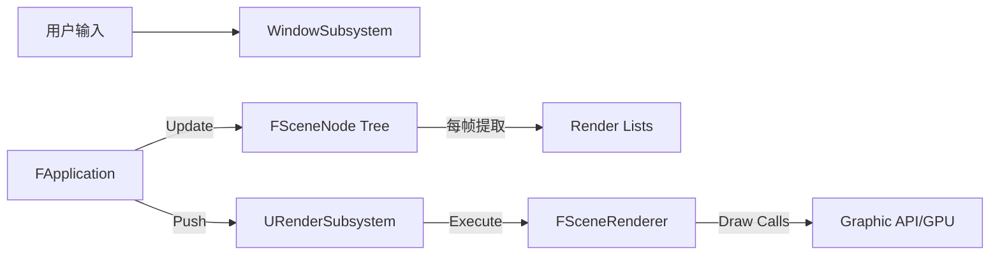

# AEngine 架构概览 (2026-01-29)

## 1. 系统核心架构 (System Core)
AEngine 采用**子系统架构 (Subsystem Architecture)**，由 `UEngine` 作为全局单例负责管理所有核心模块的生命周期。

*   **UEngine (Singleton)**: 服务定位器 (Service Locator) 和生命周期管理器。负责按顺序启动和关闭注册的子系统。
*   **IEngineSubsystem (Interface)**: 抽象基类。所有核心功能模块（窗口、渲染、物理等）必须继承自此接口。
*   **FApplication**: 应用程序基类。提供 `Run()` 主循环，并协调“逻辑更新”与“画面渲染”。

### 核心所有权关系
`FApplication` ➔ `UEngine` ➔ `Subsystems` (Window, Render)

---

## 2. 子系统职责划分 (Subsystems)

### UWindowSubsystem (窗口子系统)
*   **封装库**: GLFW。
*   **职责**: 管理窗口生命周期、处理用户输入（键盘/鼠标）、维护 OpenGL 上下文。
*   **状态**: 核心已完成。

### URenderSubsystem (渲染子系统)
*   **职责**: RHI 层的高级管理者。
*   **拥有**: 
    *   `IRHIDevice`: 负责 GPU 资源（Buffer, Texture, Shader）的分配与管理。
    *   `FSceneRenderer`: 负责复杂的场景渲染管线逻辑（延迟渲染/前向渲染）。
*   **接口**: 提供 `Render()` 方法接收渲染上下文和对象列表，解耦了底层渲染逻辑与应用层。

---

## 3. 场景图系统 (Scene Graph)

*   **FSceneNode**: 场景的基础单元，采用树状层级结构。
*   **Transform**: 内部维护局部和全局矩阵，支持父子变换关联。
*   **数据挂载**: Node 可以挂载 `FRenderable` (几何体与材质) 和 `FPointLight` (光源)。
*   **渲染提炼 (Flattening)**: 每帧应用层会遍历场景树，生成扁平化的渲染列表。

---

## 4. 渲染硬件抽象层 (RHI)

*   **IRHIDevice**: 定义了后端无关的接口（如 `CreateBuffer`, `CreateShader`）。目前由 `FOpenGLDevice` 实现。
*   **FSceneRenderer**: 核心渲染管线。
    *   **架构**: 基于 **Render Graph (渲染图)** 设计。
    *   **当前 Pass**:
        1.  `ShadowPass`: 生成阴影图。
        2.  `DeferredGeometryPass`: 填充 G-Buffer（Albedo, Normal, Metallic, Roughness）。
        3.  `DeferredLightingPass`: 计算 PBR 光照和阴影遮蔽。
        4.  `PostProcessPass`: 处理 ACES 色调映射和伽马校正。

---

## 5. 待优化的架构问题 (Upcoming Tasks)

### 🔴 跨层耦合 (Step 2 目标)
**问题**: `FSceneNode` (核心层) 直接依赖于 `RenderGraph.h` (渲染实现层) 来获取 `FRenderable` 的定义。
**方案**: 提取 `RenderCommon.h`，将渲染数据结构与具体实现分离。

### 🟡 应用循环冗余
**问题**: `FApplication::Run` 依然包含部分 `glfwSwapBuffers` 等特定平台的代码。
**方案**: 将所有平台相关逻辑下沉至 `WindowSubsystem`。

---

## 6. 核心数据流向图 (Mermaid)

